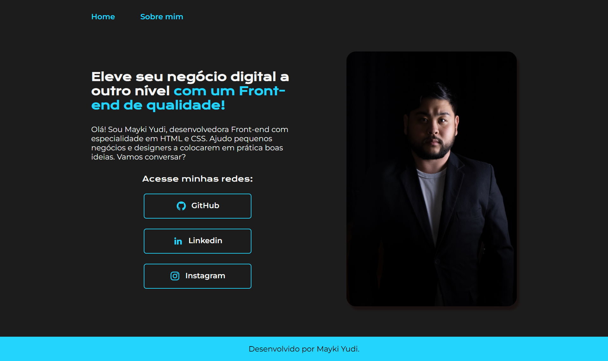
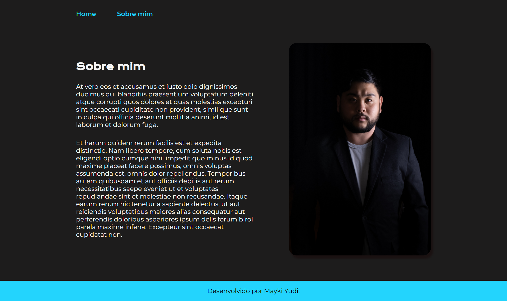

# Site Portifólio
Site desenvolvido com **HTML e CSS** para o meu **portifólio**.

---

## 📸 Preview





---

## 🚀 Tecnologias usadas
- HTML5
- CSS3
- JavaScript

---

## ✅ Funcionalidades
- [x] Página pessoal

---

## ▶️ Como rodar o projeto (local)

1. Clone o repositório:
   ```bash
   git clone https://github.com/MaykiDev/meu_portifolio.git